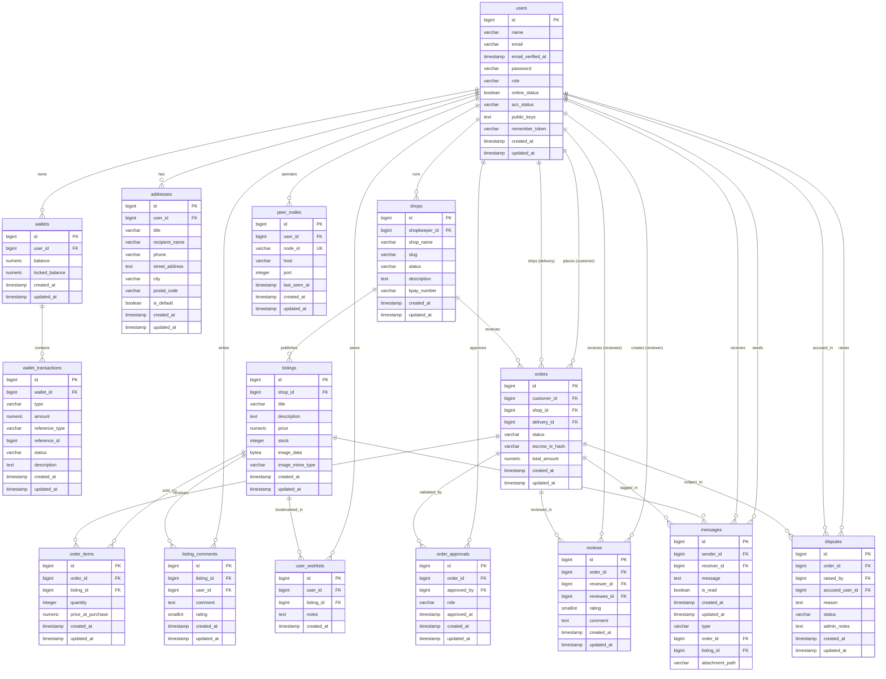
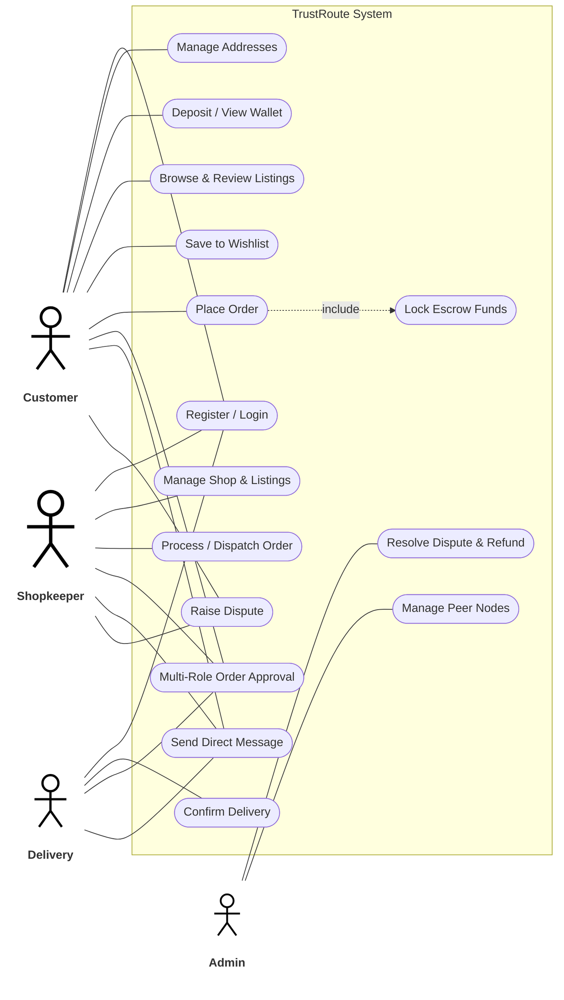
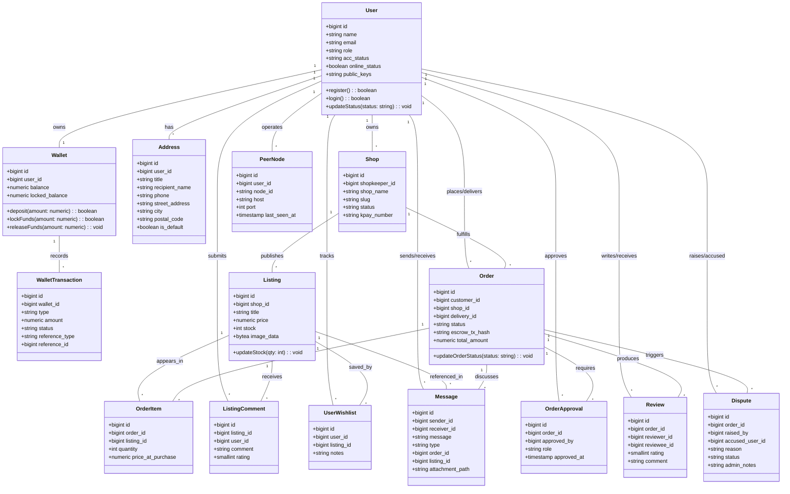
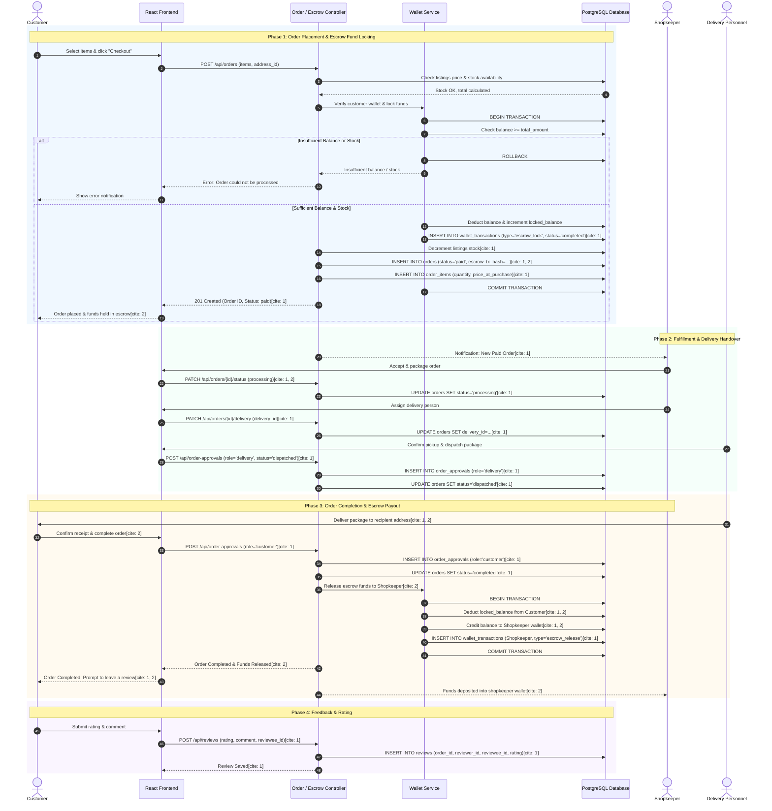

# 🛡️ TrustRoute

**TrustRoute** is an escrow-based online marketplace designed to make online shopping safer and more trustworthy[cite: 2].

It connects **customers, shopkeepers, delivery personnel, and administrators** in one platform[cite: 2].

Customers can browse products, place orders, make payments, track deliveries, and receive refunds when valid disputes are resolved[cite: 2]. Customer payments remain in a **locked balance** until the order is completed[cite: 2].

> **Status:** Under Development[cite: 2]

---

## ✨ Features

* User registration and login[cite: 2]
* Role-based access control[cite: 2]
* Customer, shopkeeper, delivery, and admin dashboards[cite: 2]
* Shop management[cite: 2]
* Product and inventory management[cite: 2]
* Shopping cart and checkout[cite: 2]
* Order management and tracking[cite: 2]
* Wallet system[cite: 2]
* Escrow-style payments[cite: 2]
* Delivery management[cite: 2]
* Dispute and refund management[cite: 2]
* User messaging[cite: 2]
* Product and shop reviews[cite: 2]

---

## 👥 User Roles

### 🛒 Customer

Customers can:

* Register and log in[cite: 2]
* Browse shops and products[cite: 2]
* Add products to a cart[cite: 2]
* Place orders[cite: 2]
* Pay for orders[cite: 2]
* Track deliveries[cite: 2]
* Manage their wallet[cite: 2]
* Create disputes[cite: 2]
* Send messages[cite: 2]
* Review completed orders[cite: 2]

### 🏪 Shopkeeper

Shopkeepers can:

* Create and manage shops[cite: 2]
* Add and manage products[cite: 2]
* Manage inventory[cite: 2]
* View and process orders[cite: 2]
* Receive payments after order completion[cite: 2]
* View reviews[cite: 2]

### 🚚 Delivery Personnel

Delivery personnel can:

* View assigned deliveries[cite: 2]
* Pick up orders[cite: 2]
* Update delivery status[cite: 2]
* Manage delivery tasks[cite: 2]
* Confirm deliveries[cite: 2]

### 👨‍💼 Administrator

Administrators can:

* Manage users[cite: 2]
* Manage shops[cite: 2]
* Monitor orders[cite: 2]
* Monitor transactions[cite: 2]
* Handle disputes[cite: 2]
* Process refunds[cite: 2]
* Manage the platform[cite: 2]

---

# 💰 Escrow Payment

The main financial concept of TrustRoute is to **protect customer payments until an order is successfully completed**[cite: 2].

```text
Customer Wallet
      │
      ▼
    Payment
      │
      ▼
 Locked Balance
      │
      ▼
Order Processing
      │
      ▼
   Delivery
      │
      ▼
Order Completed
      │
      ▼
Shopkeeper Wallet
```

### Payment Process

1. Customer pays for an order[cite: 2].
2. The payment is moved to a locked balance[cite: 2].
3. The shopkeeper processes the order[cite: 2].
4. The order is delivered[cite: 2].
5. The order is completed[cite: 2].
6. The payment is released to the shopkeeper[cite: 2].

If a problem occurs, the payment can remain locked while the dispute is reviewed[cite: 2].

---

# 📦 Order Flow

```text
Customer
   │
   ▼
Browse Products
   │
   ▼
Add to Cart
   │
   ▼
Checkout
   │
   ▼
Create Order
   │
   ▼
Payment Locked
   │
   ▼
Shop Processes Order
   │
   ▼
Delivery
   │
   ▼
Customer Receives Order
   │
   ▼
Order Completed
   │
   ▼
Payment Released
```

### Order Status

```text
pending
   ↓
paid
   ↓
processing
   ↓
dispatched
   ↓
completed
```

Other possible states:

```text
cancelled
cancellation_requested
disputed
```

---

# 🏪 Marketplace

Shopkeepers can create shops and sell products through the marketplace[cite: 2].

### Shop

A shop contains information such as:

* Shop name[cite: 1, 2]
* Description[cite: 1, 2]
* Shopkeeper / Owner[cite: 1, 2]
* Slug identifier[cite: 1]
* Payment credentials (e.g., KBZPay / kpay_number)[cite: 1]
* Shop status (`pending`, `active`, `suspended`)[cite: 1]

### Product / Listing

A listing contains:

* Title[cite: 1]
* Description[cite: 1, 2]
* Price[cite: 1, 2]
* Stock quantity[cite: 1, 2]
* Image binary data and MIME type[cite: 1]

---

# 🛒 Shopping Cart & Wishlist

Customers can manage items before placing an order:

* Save items to wishlist (`user_wishlists`) with personalized notes[cite: 1]
* Create orders with multiple order items (`order_items`) recording price at purchase[cite: 1]

---

# 🚚 Delivery

After an order is placed and processed, it can be assigned to delivery personnel[cite: 1, 2].

```text
Order Ready
    │
    ▼
Delivery Assigned
    │
    ▼
Picked Up
    │
    ▼
Dispatched
    │
    ▼
Completed & Approved
```

Multi-party sign-offs are logged in `order_approvals` to track status verifications and roles[cite: 1].

---

# ⚖️ Disputes

Users can raise disputes regarding orders[cite: 1, 2].

* Registered against an order (`order_id`)[cite: 1]
* Identifies the raising party (`raised_by`) and the accused party (`accused_user_id`)[cite: 1]
* Dispute statuses: `open`, `investigating`, `resolved_refund`, `resolved_penalize`, `closed`[cite: 1]
* Tracks resolution notes directly via `admin_notes`[cite: 1]

---

# 💬 Messaging & Reviews

TrustRoute supports direct messaging and transactional transparency:

* **Direct Messages**: Sent between users, with support for types (`text`, `order_request`, `payment_proof`, `system_alert`), optional attachments, and references to specific `order_id` or `listing_id`[cite: 1].
* **Order Reviews**: Bilateral ratings (1–5) and feedback submitted between reviewer and reviewee after order execution[cite: 1].
* **Listing Comments**: Public product comments and star ratings (1–5) directly on listings[cite: 1].

---

# 🏗️ System Architecture

TrustRoute uses a separate **React frontend** and **Laravel REST API backend**[cite: 2].

```text
┌─────────────────────────┐
│      React Frontend     │
│                         │
│  React + Vite           │
│  TailwindCSS            │
│  React Router           │
│  Axios                  │
└────────────┬────────────┘
             │
             │ REST API
             ▼
┌─────────────────────────┐
│     Laravel Backend     │
│                         │
│  Laravel 11             │
│  PHP 8.2+               │
│  Laravel Sanctum         │
└────────────┬────────────┘
             │
             ▼
┌─────────────────────────┐
│       PostgreSQL        │
└─────────────────────────┘
```

---

# 💻 Technology Stack

| Component      | Technology      |
| -------------- | --------------- |
| Frontend       | React 18[cite: 2]        |
| Build Tool     | Vite[cite: 2]            |
| Styling        | TailwindCSS[cite: 2]     |
| Routing        | React Router[cite: 2]    |
| HTTP Client    | Axios[cite: 2]           |
| Backend        | Laravel 11[cite: 2]      |
| Language       | PHP 8.2+[cite: 2]        |
| Authentication | Laravel Sanctum[cite: 2] |
| Database       | PostgreSQL[cite: 2]      |
| API            | REST API[cite: 2]        |

---

# 📁 Project Structure

```text
TrustRoute/
│
├── backend/
│   ├── app/
│   ├── bootstrap/
│   ├── config/
│   ├── database/
│   ├── public/
│   ├── routes/
│   ├── storage/
│   ├── tests/
│   ├── .env.example
│   └── composer.json
│
├── frontend/
│   ├── src/
│   ├── public/
│   ├── index.html
│   ├── package.json
│   └── vite.config.js
│
├── LICENSE
└── README.md
```

---

# 🗄️ Database

TrustRoute runs on **PostgreSQL**[cite: 2].

The schema includes the following tables:

* `users`: User profiles, roles, and status[cite: 1]
* `addresses`: User shipping and billing addresses[cite: 1]
* `wallets`: User escrow balances and locked funds[cite: 1]
* `wallet_transactions`: Ledger tracking credits, debits, and escrow references[cite: 1]
* `shops`: Shopkeeper storefronts and payment accounts[cite: 1]
* `listings`: Products catalog and inventory stock[cite: 1]
* `listing_comments`: Ratings and reviews for specific listings[cite: 1]
* `user_wishlists`: Bookmarked listings per user[cite: 1]
* `orders`: Order header, delivery assignment, status, and escrow hash[cite: 1]
* `order_items`: Line items capturing listing purchase snapshots[cite: 1]
* `order_approvals`: Multi-party role confirmations on orders[cite: 1]
* `reviews`: Post-order feedback between users[cite: 1]
* `disputes`: Dispute cases raised on orders[cite: 1]
* `messages`: Direct communication and transactional notifications[cite: 1]
* `peer_nodes`: Distributed node host registry per user[cite: 1]

### Main Relationships

```text
User
 ├── Addresses
 ├── Wallet (1:1)
 ├── Shop (Shopkeeper)
 ├── Orders (Customer / Delivery)
 ├── Order Approvals
 ├── Listing Comments
 ├── User Wishlists
 ├── Reviews (Reviewer / Reviewee)
 ├── Disputes (Raised By / Accused)
 ├── Messages (Sender / Receiver)
 └── Peer Nodes

Shop
 ├── Listings
 └── Orders (Fulfilled)

Listing
 ├── Order Items
 ├── Listing Comments
 ├── User Wishlists
 └── Messages (Optional Context)

Order
 ├── Order Items
 ├── Order Approvals
 ├── Reviews
 ├── Disputes
 └── Messages (Optional Context)

Wallet
 └── Wallet Transactions
```

---

# 🗃️ ER Diagram



---

# 🔐 Authentication

TrustRoute uses **Laravel Sanctum** for API authentication[cite: 2].

Authentication provides:

* Registration[cite: 2]
* Login[cite: 2]
* Logout[cite: 2]
* Protected API access via Bearer tokens[cite: 2]
* Role-based authorization (`customer`, `shopkeeper`, `delivery`, `admin`)[cite: 1, 2]

---

# 🔌 REST API

The React frontend communicates with Laravel through REST APIs[cite: 2].

Main API endpoints:

```text
/api/auth
/api/users
/api/addresses
/api/shops
/api/listings
/api/wishlist
/api/orders
/api/order-approvals
/api/wallet
/api/disputes
/api/messages
/api/reviews
```

---

# 🚀 Installation

## Requirements

Install:

* PHP 8.2+[cite: 2]
* Composer[cite: 2]
* Node.js 18+[cite: 2]
* npm[cite: 2]
* PostgreSQL[cite: 2]
* Git[cite: 2]

Check the installed versions[cite: 2]:

```bash
php --version
composer --version
node --version
npm --version
psql --version
```

---

## 1. Clone the Repository

```bash
git clone <repository-url>
cd TrustRoute
```

---

## 2. Setup Backend

```bash
cd backend
composer install
```

Create the environment file[cite: 2]:

```bash
cp .env.example .env
```

Generate the application key[cite: 2]:

```bash
php artisan key:generate
```

---

## 3. Configure PostgreSQL

Create a database named:

```text
trustroute
```

Update `backend/.env`[cite: 2]:

```env
DB_CONNECTION=pgsql
DB_HOST=127.0.0.1
DB_PORT=5432
DB_DATABASE=trustroute
DB_USERNAME=postgres
DB_PASSWORD=your_password
```

Run migrations[cite: 2]:

```bash
php artisan migrate
```

If seeders are available[cite: 2]:

```bash
php artisan migrate --seed
```

---

## 4. Start Backend

From the `backend` directory[cite: 2]:

```bash
php artisan serve
```

Default address[cite: 2]:

```text
[http://127.0.0.1:8000](http://127.0.0.1:8000)
```

---

## 5. Setup Frontend

Open another terminal[cite: 2]:

```bash
cd frontend
npm install
```

Start the development server[cite: 2]:

```bash
npm run dev
```

Default address[cite: 2]:

```text
http://localhost:5173
```

---

# 🧪 Development Commands

## Backend

Start Laravel[cite: 2]:

```bash
php artisan serve
```

Run migrations[cite: 2]:

```bash
php artisan migrate
```

Reset database[cite: 2]:

```bash
php artisan migrate:fresh
```

Reset and seed[cite: 2]:

```bash
php artisan migrate:fresh --seed
```

Run tests[cite: 2]:

```bash
php artisan test
```

## Frontend

Start development server[cite: 2]:

```bash
npm run dev
```

Build for production[cite: 2]:

```bash
npm run build
```

Preview production build[cite: 2]:

```bash
npm run preview
```

---

# 🔒 Security

* Password hashing[cite: 2]
* Token authentication via Laravel Sanctum[cite: 2]
* Role-based authorization[cite: 2]
* Server-side input and payload validation[cite: 2]
* Protected REST API routes[cite: 2]
* Atomic database transactions for wallet operations[cite: 2]
* Secure environment variable storage[cite: 2]

---

# 📊 System Diagrams

## 1. Use Case Diagram



---

## 2. Class Diagram



---

## 3. Order Checkout Sequence



---

# 📄 License

This project is licensed under the **MIT License**[cite: 2].

See the `LICENSE` file for details[cite: 2].

---

# 👨‍💻 Author

**Lwin Ko**[cite: 2]

University of Computer Studies, Monywa[cite: 2]

---

## 🛡️ TrustRoute

**A marketplace designed to make online shopping safer through escrow-based payments, shop management, delivery tracking, and dispute handling.**[cite: 2]