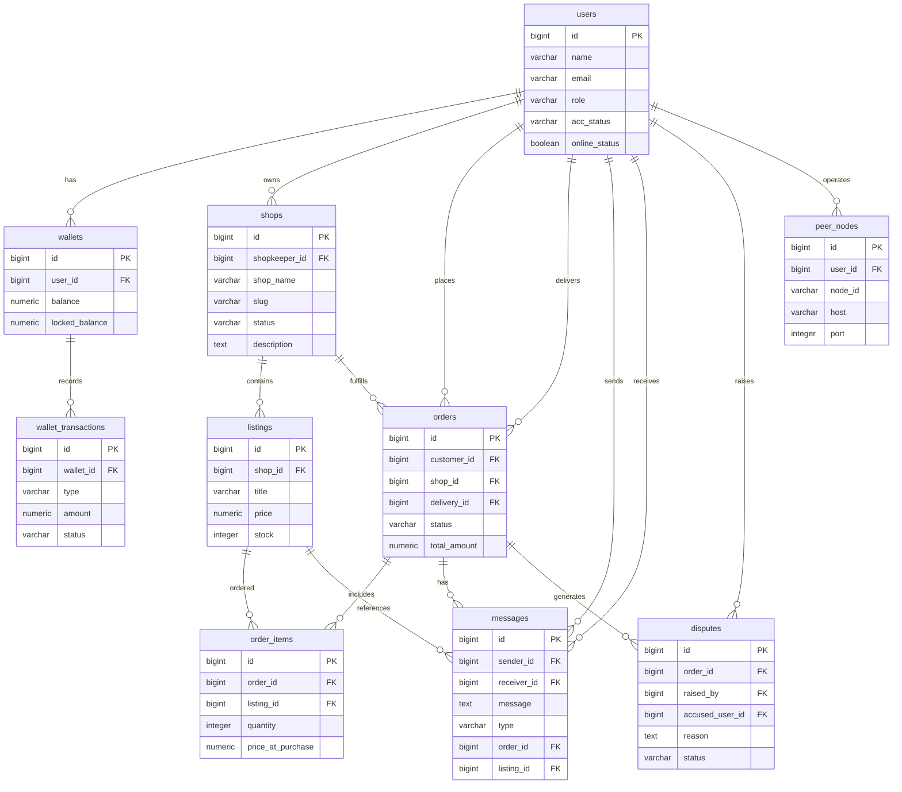

# 🛡️ TrustRoute

**TrustRoute** is an escrow-based online marketplace designed to make online shopping safer and more trustworthy.

It connects **customers, shopkeepers, delivery personnel, and administrators** in one platform.

Customers can buy products, make payments, track deliveries, and receive their money back when a valid dispute is resolved. Payments are kept in a **locked balance** until the order is completed.

> **Status:** Under Development

---

## ✨ Main Features

* User registration and login
* Role-based access
* Customer, shopkeeper, delivery, and admin dashboards
* Shop management
* Product management
* Inventory management
* Shopping cart
* Checkout
* Order management
* Order tracking
* Wallet system
* Escrow-style payments
* Delivery management
* Dispute handling
* Refund management
* User messaging
* Product/shop reviews

---

## 👥 User Roles

### 🛒 Customer

Customers can:

* Register and log in
* Browse shops and products
* Add products to cart
* Place orders
* Pay for orders
* Track orders
* Manage their wallet
* Create disputes
* Send messages
* Review completed orders

### 🏪 Shopkeeper

Shopkeepers can:

* Create a shop
* Manage shop information
* Add and manage products
* Manage product stock
* View customer orders
* Process orders
* Receive payments after completion
* View reviews

### 🚚 Delivery Personnel

Delivery personnel can:

* View assigned deliveries
* Pick up orders
* Update delivery status
* Manage delivery tasks
* Confirm deliveries

### 👨‍💼 Admin

Administrators can:

* Manage users
* Manage shops
* Monitor orders
* Monitor transactions
* Handle disputes
* Process refunds
* Manage the platform

---

# 💰 Escrow Payment System

The main idea of TrustRoute is to **protect the customer's payment until the order is completed**.

### Payment Flow

```text
Customer Wallet
      ↓
   Payment
      ↓
 Locked Balance
      ↓
Order Processing
      ↓
   Delivery
      ↓
Order Completed
      ↓
Shopkeeper Wallet
```

The payment is **not immediately given to the shopkeeper**.

Instead:

1. The customer pays for the order.
2. The payment is moved to a locked balance.
3. The shopkeeper processes the order.
4. The order is delivered.
5. The order is completed.
6. The payment is released to the shopkeeper.

If a problem occurs, the payment can remain locked while the dispute is reviewed.

---

# 📦 Order Flow

```text
Customer
   ↓
Browse Products
   ↓
Add to Cart
   ↓
Checkout
   ↓
Create Order
   ↓
Payment Locked
   ↓
Shop Processes Order
   ↓
Delivery
   ↓
Customer Receives Order
   ↓
Order Completed
   ↓
Payment Released
```

### Order Status

An order can have states such as:

```text
Pending
Confirmed
Processing
Dispatched
Out for Delivery
Delivered
Completed
Cancelled
Disputed
Refunded
```

---

# 🏪 Marketplace

Shopkeepers can create shops and sell products through the marketplace.

### Shop

A shop can contain:

* Shop name
* Description
* Owner
* Products
* Contact information
* Shop status

### Product

A product can contain:

* Product name
* Description
* Price
* Stock quantity
* Category
* Image
* Availability

---

# 🛒 Shopping Cart

Customers can add products to their cart before placing an order.

The cart supports:

* Add product
* Remove product
* Change quantity
* View subtotal
* View total
* Checkout

Example:

```text
Product A × 2
Product B × 1
Product C × 3
----------------
Total
```

---

# 🚚 Delivery

After a shopkeeper prepares an order, the order can be assigned to a delivery person.

```text
Order Ready
    ↓
Delivery Assigned
    ↓
Picked Up
    ↓
Out for Delivery
    ↓
Delivered
```

Delivery personnel update the delivery status through their dashboard.

---

# ⚖️ Disputes

Customers can create a dispute when there is a problem with an order.

Examples:

* Product not received
* Wrong product
* Damaged product
* Delivery problem
* Other order problems

### Dispute Flow

```text
Customer
   ↓
Create Dispute
   ↓
Admin Review
   ↓
Resolution
```

Depending on the situation, the administrator can:

* Refund the customer
* Release the payment
* Take another appropriate action

---

# 💬 Messaging

TrustRoute supports communication between users.

Messages can be related to:

* Orders
* Shops
* Products
* Deliveries
* Payments

---

# ⭐ Reviews

Customers can review completed orders.

A review can contain:

* Rating
* Comment
* Customer
* Shop or product
* Order
* Date

Reviews help customers evaluate shops and products.

---

# 🏗️ System Architecture

TrustRoute uses a separate **React frontend** and **Laravel REST API backend**.

```text
┌─────────────────────────┐
│     React Frontend      │
│                         │
│ React + Vite            │
│ TailwindCSS             │
│ React Router            │
│ Axios                   │
└────────────┬────────────┘
             │
             │ REST API
             ↓
┌─────────────────────────┐
│     Laravel Backend     │
│                         │
│ Laravel 11              │
│ PHP 8.2+                │
│ Laravel Sanctum         │
└────────────┬────────────┘
             │
             ↓
┌─────────────────────────┐
│       PostgreSQL        │
└─────────────────────────┘
```

---

# 💻 Technology Stack

| Part           | Technology      |
| -------------- | --------------- |
| Frontend       | React 18        |
| Build Tool     | Vite            |
| Styling        | TailwindCSS     |
| Routing        | React Router    |
| HTTP Client    | Axios           |
| Backend        | Laravel 11      |
| Language       | PHP 8.2+        |
| Authentication | Laravel Sanctum |
| Database       | PostgreSQL      |
| API            | REST API        |

---

# 📁 Project Structure

```text
TrustRoute/
│
├── backend/
│   ├── app/
│   ├── bootstrap/
│   ├── config/
│   ├── database/
│   ├── public/
│   ├── routes/
│   ├── storage/
│   ├── tests/
│   ├── .env.example
│   └── composer.json
│
├── frontend/
│   ├── src/
│   ├── public/
│   ├── index.html
│   ├── package.json
│   └── vite.config.js
│
├── LICENSE
└── README.md
```

---

# 🗄️ Database

TrustRoute uses **PostgreSQL**.

The database manages:

* Users
* Shops
* Products / Listings
* Inventory
* Carts
* Orders
* Order items
* Wallets
* Wallet transactions
* Deliveries
* Disputes
* Messages
* Reviews
* Peer nodes

### Main Relationships

```text
User
 ├── Shop
 ├── Order
 ├── Wallet
 ├── Message
 ├── Review
 ├── Dispute
 └── Peer Node

Shop
 └── Listings

Order
 ├── Order Items
 ├── Delivery
 ├── Messages
 └── Dispute

Wallet
 └── Wallet Transactions
```

---

# 🗃️ Database ER Diagram



---

# 🔐 Authentication

The backend uses **Laravel Sanctum** for authentication.

Authentication provides:

* Registration
* Login
* Logout
* Protected API access
* Role-based authorization

Different roles have different permissions and access to different parts of the system.

---

# 🔌 REST API

The React frontend communicates with Laravel through REST APIs.

Main API areas include:

```text
/api/auth
/api/users
/api/shops
/api/products
/api/cart
/api/orders
/api/wallet
/api/deliveries
/api/disputes
/api/messages
/api/reviews
```

> API routes may change as development continues.

---

# 🚀 Installation

## Requirements

Install the following:

* PHP 8.2+
* Composer
* Node.js 18+
* npm
* PostgreSQL
* Git

Check the installed versions:

```bash
php --version
composer --version
node --version
npm --version
psql --version
```

---

## 1. Clone the Repository

```bash
git clone <repository-url>
cd TrustRoute
```

---

## 2. Setup the Backend

```bash
cd backend
composer install
```

Create the environment file:

```bash
cp .env.example .env
```

Generate the Laravel application key:

```bash
php artisan key:generate
```

---

## 3. Setup PostgreSQL

Create a PostgreSQL database named:

```text
trustroute
```

Configure `backend/.env`:

```env
DB_CONNECTION=pgsql
DB_HOST=127.0.0.1
DB_PORT=5432
DB_DATABASE=trustroute
DB_USERNAME=postgres
DB_PASSWORD=your_password
```

Run the database migrations:

```bash
php artisan migrate
```

If seeders are available:

```bash
php artisan migrate --seed
```

---

## 4. Start the Backend

From the `backend` directory:

```bash
php artisan serve
```

The backend will normally run at:

```text
http://127.0.0.1:8000
```

---

## 5. Setup the Frontend

Open another terminal:

```bash
cd frontend
npm install
```

Start the development server:

```bash
npm run dev
```

The frontend will normally run at:

```text
http://localhost:5173
```

---

# 🧪 Development Commands

## Backend

Start Laravel:

```bash
php artisan serve
```

Run migrations:

```bash
php artisan migrate
```

Reset the database:

```bash
php artisan migrate:fresh
```

Reset and seed:

```bash
php artisan migrate:fresh --seed
```

Run tests:

```bash
php artisan test
```

---

## Frontend

Start development server:

```bash
npm run dev
```

Build for production:

```bash
npm run build
```

Preview production build:

```bash
npm run preview
```

---

# 🔒 Security

Because TrustRoute handles user accounts and payments, security is important.

The system should use:

* Password hashing
* Authentication
* Role-based authorization
* Request validation
* Protected API routes
* Database transactions
* Secure environment variables
* Proper error handling

### Important

Never commit:

```text
.env
```

or database passwords and other private credentials to Git.

---

# 📌 Core Transaction Rule

The most important financial rule in TrustRoute is:

```text
Customer Payment
       ↓
 Locked Balance
       ↓
Order Completed
       ↓
Shopkeeper Wallet
```

Customer money should remain locked until the order is successfully completed or the dispute process decides what should happen to the payment.

---

# 📄 License

This project is licensed under the **MIT License**.

See the `LICENSE` file for details.

---

# 👨‍💻 Author

**Lwin Ko**

University of Computer Studies, Monywa

---

## 🛡️ TrustRoute

**A marketplace designed to make online shopping safer through escrow-based payments, shop management, delivery tracking, and dispute handling.**
